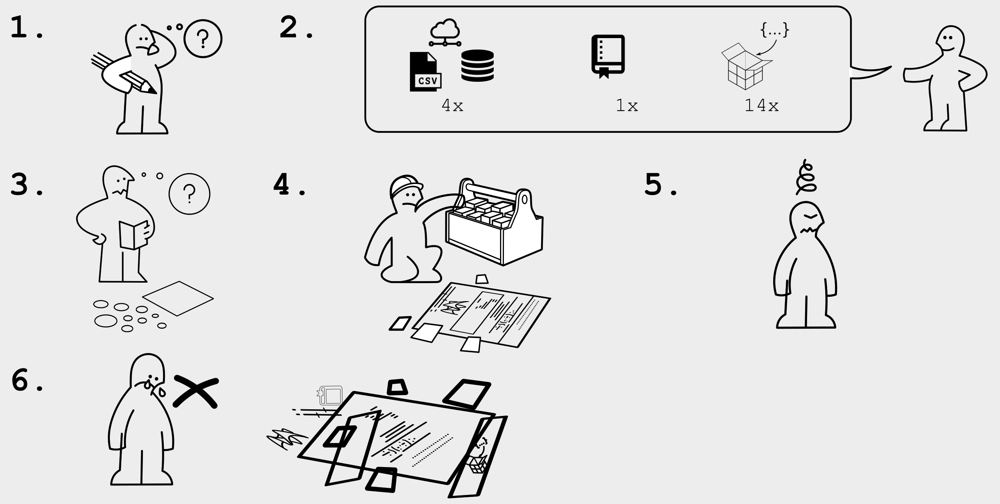
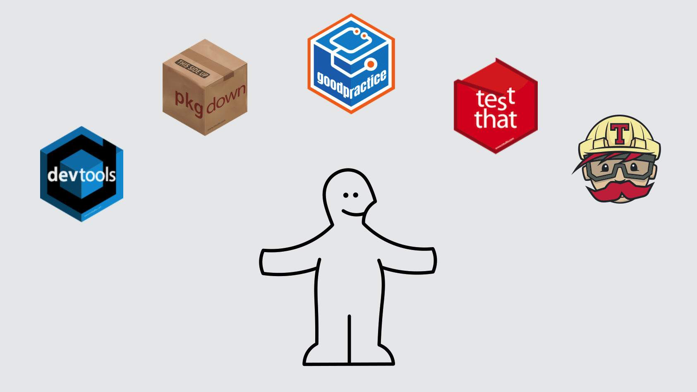

```{r xaringan-themer, include = FALSE}
library(xaringanthemer)
mono_accent_inverse(
  base_color = "#3C989E",
  header_font_google = google_font("Gayathri", "700"),
  text_font_google   = google_font("Montserrat", "300", "300i"),
  code_font_google   = google_font("Source Code Pro")
)
```


# `r emo::ji("wave")` Hello and welcome

### me: Dr Anna Krystalli

- **Research Software Engineer**, _University of Sheffield_
    + twitter **@annakrystalli**
    + github **@annakrystalli**
    + email **a.krystalli[at]sheffield.ac.uk**
    
- **Editor [rOpenSci](http://onboarding.ropensci.org/)**

---

# Background

### The paper is the advertisement

> “an article about computational result is advertising, not scholarship. The **actual scholarship is the full software environment, code and data, that produced the result.**”

*John Claerbout paraphrased in [Buckheit and Donoho (1995)](https://statweb.stanford.edu/~wavelab/Wavelab_850/wavelab.pdf)*


---
## Is published code and data enough?


.center[

]

.img-attr[slides: [_Karthik Ram: rstudio::conf 2019 talk_](https://github.com/karthik/rstudio2019)]

---
### The concept of a Research Compendium

>“
...We introduce the **concept of a compendium**
as both a **container for the different elements**
that make up the document and its computations (i.e. text, code, data, ...), and as a **means for distributing, managing and updating the
collection**."

[_Gentleman and Temple Lang, 2004_](https://biostats.bepress.com/bioconductor/paper2/)

---

### The Research Compendium in R

> R packages can be used as a research compendium for organising and sharing files!


**Ben Marwick, Carl Boettiger & Lincoln Mullen (2018)** [_Packaging Data Analytical Work Reproducibly Using R (and Friends)_](https://peerj.com/preprints/3192/)

--

.center[

]

.img-attr[slides: [_Karthik Ram: rstudio::conf 2019 talk_](https://github.com/karthik/rstudio2019)]

---
## Enter `rrtools`

> The goal of rrtools is to provide **instructions, templates, and functions** for making a **basic compendium** suitable for writing **reproducible research with R**.

--

# `rrtools` demo

### **Create a research compendium** and **recreate a research paper** from **data, analysis code and text**.

---

### demo materials - source: `cboettig/noise-phenomena`

**Subset of materials from the published compendium** of code, data, and author's manuscript: 

.pull-left[
##### Carl Boettiger. (2018, April 17). *cboettig/noise-phenomena: Supplement to: "From noise to knowledge: how randomness generates novel phenomena and reveals information"* (Version revision-2). *Zenodo*. http://doi.org/10.5281/zenodo.1219780

accompanying the publication:

##### Carl Boettiger [](https://orcid.org/0000-0002-1642-628X). *From noise to knowledge: how randomness generates novel phenomena and reveals information*.  Published in *Ecology Letters*, 22 May 2018 <https://doi.org/10.1111/ele.13085>
]

.pull-right[

]

---
### demo materials - access

#### [bit.ly/rrtools_wks](https:bit.ly/rrtools_wks)

### workflow code
